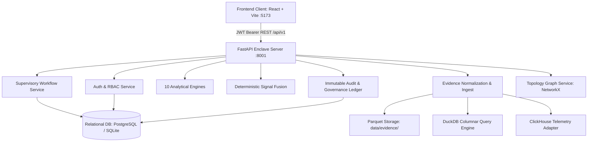

# SAT-SA System Audit & Full Prototype Integration Status
**Supervisory Analytics Tool for SOC Assessment (SAT-SA)**  
*Document Version: OPS-v4.8-GOV-FIPS | Assessment Period: Q3 2026 Cycle*  
*Air-Gapped Institutional Compliance Specification & Integration Matrix*

---

## 1. Executive Summary & Repository Status

A full audit of the SAT-SA repository across `frontend/`, `backend/`, and the data tier was conducted. The frontend contract acts as the primary specification.

- **Frontend (`React 19 + Vite 8 + Tailwind CSS`)**: Built with zero compilation errors (`tsc -b && vite build` passed) and 0 linter errors (`oxlint` passed). Connected via standardized typed API clients (`frontend/src/api/*`) and React context (`SupervisoryContext.tsx`).
- **Backend (`FastAPI 0.115 + SQLAlchemy 2.0 + PyArrow / DuckDB`)**: Running as an active daemon on expected port **8001** (`/api/v1/health` -> `UP`, version `OPS-v4.8`). Test suite executed with **78 / 78 passed tests** (`backend/.venv/bin/pytest`).
- **Relational & Forensic Storage Tier**: Relational schema defined across 17 SQLAlchemy models with Alembic migrations and SQLite fallback (`sat_sa.db`, with PostgreSQL connection capability). Columnar evidence processing is supported via **PyArrow Parquet** serialization and local **DuckDB** analytical queries, complemented by an offline **ClickHouse** HTTP telemetry adapter buffer.

---

## 2. Repository Architecture & Component Breakdown



### Component Inventory

1. **Backend Functionality Present**:
   - **Authentication & RBAC**: JWT Bearer token generation, password hashing (`bcrypt`), role enforcement (`SUPERVISOR`, `EXAMINER`, `LEAD_EXAMINER`, `AUDITOR`, `ADMINISTRATOR`), granular permission guards (`findings:validate`, `evidence:demand`, `sampling:run`, etc.).
   - **10 Authoritative Analytical Engines**:
     - `execution_gap`: Detects missing, delayed, or out-of-order workflow steps.
     - `negative_space`: Identifies expected evidence and telemetries that failed to materialize.
     - `coverage`: Measures telemetry coverage voids across monitored assets, busbars, and alert classes.
     - `process`: Audits deviations from statutory SOC triage runbooks.
     - `investigation_quality`: Analyzes investigator depth, shallow closures, and missing linkages.
     - `behavioural`: Unsupervised statistical outlier detection in analyst disposition velocity.
     - `historical`: Temporal regression matching comparing prior audit cycles.
     - `peer`: Cross-CSE cohort benchmarking within peer sectors.
     - `consistency`: Cross-source corroboration across SIEM, PAM, ITSM, and network flows.
     - `metric_integrity`: Identifies synthetic, smoothed, or statistically suspect reporting values.
   - **Deterministic Signal Fusion**: Fuses multiple detection vectors into composite candidate findings with corroborating proof.
   - **Evidence & Storage Handling**: OCSF-aligned canonical normalization, Parquet file generation, SHA-256 integrity verification, and DuckDB analytical queries.
   - **Supervisory Workflows**: Examiner qualification, formal statutory validation, override with justification, evidence demand issuance, remediation tracking, and verification gate evaluations.
   - **Governance & Audit**: Append-only cryptographic ledger (`AuditEvent`), user management, role permissions, control registry (`CTRL-01` through `CTRL-15`), and release version tracking.
   - **Directed Topology Graph**: Dynamic multi-layer network graph generation (`CSE -> CONTROL -> EVIDENCE -> SIGNAL -> FINDING -> REMEDIATION -> VERIFICATION`).

2. **Missing / Gaps Identified & Resolved**:
   - **Dynamic Findings List**: In `FindingsListPage.tsx`, hardcoded mock arrays were updated to bind directly to live findings in `SupervisoryContext` while preserving all UI badges and layout.
   - **Governance Adapters**: Type mismatches in `governanceApi.getSystemVersions` and control mapping were aligned with the frontend interfaces.
   - **Regressions Data Pipeline**: Derived regression items were safeguarded against undefined evaluation dates.
   - **Evidence Response Normalization**: Ingestion endpoint response formatting handles both paginated objects and direct item arrays.

---

## 3. Frontend Route Contract Extraction

The table below documents the primary UI routes, components, required backend API endpoints, and data entities:

| Frontend Route | React Component | API Endpoint Requirement | Primary Data Entity | Backend Service / Source |
|---|---|---|---|---|
| `/login` | `LoginPage` | `POST /api/v1/auth/login`<br>`GET /api/v1/auth/me` | `User`, `Token` | `auth_service.py` |
| `/overview` | `DashboardOverviewPage` | `GET /api/v1/overview`<br>`GET /api/v1/cses`<br>`GET /api/v1/findings` | `OverviewResponse`, `CSE`, `Finding` | `supervisory_service.py` |
| `/supervision/cses` | `CSEAssessmentsListPage` | `GET /api/v1/cses`<br>`POST /api/v1/evidence/ingest` | `CSEListItem[]` | `cse_service.py` |
| `/supervision/cses/:cseId` | `CSEDetailPage` | `GET /api/v1/cses/{id}`<br>`GET /api/v1/evidence?cse_id=...`<br>`GET /api/v1/findings?cse_id=...` | `CSEDetail`, `Evidence[]`, `Finding[]` | `cse_service.py`, `evidence_service.py` |
| `/review` & `/review/findings` | `ReviewQueuePage` | `GET /api/v1/findings/review-queue`<br>`POST /api/v1/findings/{id}/evidence-demand` | `FindingResponse[]` | `finding_service.py` |
| `/findings/:findingId` | `FindingDetailPage` | `GET /api/v1/findings/{id}/workspace`<br>`POST /api/v1/findings/{id}/validate`<br>`POST /api/v1/findings/{id}/qualify`<br>`POST /api/v1/findings/{id}/reject`<br>`POST /api/v1/findings/{id}/override` | `ExaminerWorkspaceResponse` | `finding_service.py` |
| `/evidence` | `EvidenceExplorerPage` | `GET /api/v1/evidence`<br>`GET /api/v1/evidence/{id}/verify-integrity`<br>`POST /api/v1/evidence/ingest` | `EvidenceResponse[]`, `EvidenceIntegrityResponse` | `evidence_service.py`, `storage.py` |
| `/sampling` | `SamplingPage` | `GET /api/v1/sampling/runs`<br>`POST /api/v1/sampling/runs`<br>`PATCH /api/v1/sampling/items/{id}/selection` | `SamplingRunResponse`, `SamplingItemResponse` | `supervisory_service.py` |
| `/analysis` | `AnalysisHubPage` | `GET /api/v1/analysis/metrics`<br>`GET /api/v1/analysis/engines` | `EngineMeta[]`, `AnalysisHubMetrics` | `analysis_service.py` |
| `/analysis/:engineSlug` | `EngineDetailPage` | `GET /api/v1/analysis/signals?engine={slug}`<br>`POST /api/v1/analysis/run/{slug}` | `AnalyticalSignal[]` | `analysis_service.py`, `engine_registry` |
| `/remediation` | `RemediationPage` | `GET /api/v1/remediation`<br>`POST /api/v1/remediation/{id}/submit`<br>`GET /api/v1/verification`<br>`POST /api/v1/verification/{id}/gates/{gateId}/verify`<br>`POST /api/v1/verification/{id}/seal`<br>`POST /api/v1/verification/{id}/reopen` | `RemediationResponse[]`, `VerificationResultResponse[]` | `supervisory_service.py` |
| `/governance` | `GovernanceHubPage` | `GET /api/v1/governance/audit`<br>`GET /api/v1/governance/users`<br>`GET /api/v1/governance/roles`<br>`GET /api/v1/governance/access`<br>`GET /api/v1/controls`<br>`GET /api/v1/governance/versions` | `AuditEvent[]`, `User[]`, `Control[]`, `SystemVersion[]` | `governance_service.py` |
| `/graph` | `SupervisoryEvidenceGraphPage` | `GET /api/v1/graph?cse_id={cseId}` | `GraphResponse` (`nodes`, `links`) | `governance_service.py`, `NetworkX` |

---

## 4. Data Contract & Compatibility Matrix

| Entity | Frontend Interface (`frontend/src/types/`) | Backend Pydantic Schema (`backend/app/schemas/`) | Database Model (`backend/app/db/models/`) | Compatibility Notes |
|---|---|---|---|---|
| **CSE** | `CSEAssessment` (`cseId`, `cseName`, `sector`, `evidenceReadiness`, `status`, `claimedCapability`, `observedCapability`) | `CSEListItem` / `CSEDetailResponse` | `CSE` (`public_id`, `name`, `sector`, `evidence_readiness`, `status`, `claimed_capability`) | 100% Compatible (Pydantic schema serializes both `id`, `cseId`, `cseName`). |
| **Finding** | `Finding` (`id`, `cseId`, `controlId`, `whyFlagged`, `signalType`, `expectedState`, `observedState`, `status`, `completeness`, `uncertainty`, `provenance`) | `FindingResponse` / `ExaminerWorkspaceResponse` | `Finding` (`public_id`, `cse_id`, `control_id`, `why_flagged`, `signal_type`, `expected_state`, `observed_state`, `status`) | 100% Compatible (Dual camelCase/snake_case serialization in schema). |
| **Evidence** | `MockEvidenceRecord` (`id`, `type`, `recordType`, `cseId`, `sha256`, `provenance`, `status`) | `EvidenceResponse` (`id`, `evidence_id`, `public_id`, `category`, `sha256`, `provenance`) | `Evidence` (`public_id`, `category`, `state`, `sha256`, `file_path`, `file_size`) | 100% Compatible via `adaptBackendEvidence` in `evidenceApi`. |
| **Signal** | `AnalyticsSignal` (`signalId`, `engineType`, `cseId`, `priority`, `expected`, `observed`, `difference`) | `SignalResponse` / `AnalyticalSignalResponse` | `Signal` / `AnalyticalSignalModel` (`signal_id`, `engine_type`, `cse_id`, `priority`, `expected`, `observed`) | 100% Compatible via `adaptBackendSignal` in `analysisApi`. |
| **Remediation** | `RemediationMandate` (`id`, `findingId`, `cseId`, `controlRef`, `priority`, `dueDate`, `status`, `artifacts`, `milestones`) | `RemediationResponse` (`remediation_id`, `finding_public_id`, `cse_public_id`, `due_date`, `status`) | `Remediation` (`remediation_id`, `finding_public_id`, `cse_public_id`, `priority`, `due_date`, `status`) | 100% Compatible via `adaptBackendRemediation`. |
| **Verification** | `VerificationRecord` (`id`, `mandateId`, `verificationVerdict`, `confidenceScore`, `gates`, `merkleRootHash`) | `VerificationResultResponse` (`verification_id`, `mandate_public_id`, `verification_verdict`, `gates`) | `VerificationResult` & `VerificationGate` (`verification_id`, `verification_verdict`, `merkle_root_hash`) | 100% Compatible via `adaptBackendVerification`. |
| **Audit Event** | `AuditTrailItem` (`id`, `timestamp`, `action`, `actor`, `target`, `details`, `integrityProof`) | `AuditEventResponse` (`event_id`, `timestamp`, `action`, `actor_id`, `before`, `after`) | `AuditEvent` (`event_id`, `timestamp`, `action`, `actor_id`, `before`, `after`) | 100% Compatible via `adaptBackendAuditEvent`. |
| **User** | `SystemUser` (`id`, `username`, `name`, `email`, `role`, `status`, `badge`, `organization`, `permissions`) | `UserAdminResponse` (`id`, `public_id`, `username`, `name`, `email`, `role`, `status`, `permissions`) | `User` & `Role` (`public_id`, `username`, `email`, `role`, `is_active`) | 100% Compatible via `adaptBackendUser`. |
| **Control** | `SupervisoryControl` (`id`, `name`, `domain`, `status`, `version`, `expectedCapability`, `expectedEvidence`) | `ControlDetailResponse` (`control_id`, `code`, `title`, `domain`, `status`, `version`) | `Control` (`public_id`, `code`, `title`, `domain`, `status`, `version`) | 100% Compatible via `adaptBackendControl`. |
| **System Version**| `SystemComponentVersion` (`id`, `component`, `version`, `type`, `status`, `released`, `activeSince`, `hashSignature`) | `SystemVersionResponse` (`version`, `release_name`, `component`, `status`, `git_commit`, `deployed_at`) | `SystemVersion` (`version`, `release_name`, `component`, `status`, `git_commit`, `deployed_at`) | 100% Compatible via `governanceApi.getSystemVersions`. |

---

## 5. Mock / Dummy Data Audit & Classification

| Source Location | Variable / Asset | Classification | Action Taken / Rationale |
|---|---|---|---|
| `frontend/src/data/mock/findings.ts` | `mockFindings` | **REMOVE (from live queue)** | Replaced by live findings in `ReviewQueuePage` and `FindingsListPage`. Retained solely as deterministic type template for static testing. |
| `frontend/src/data/mock/evidence.ts` | `mockEvidence` | **REMOVE (from active explorer)** | Replaced by real backend evidence query (`/evidence`) in `SupervisoryContext` and `EvidenceExplorerPage`. |
| `frontend/src/data/mock/remediation.ts` | `mockRemediations`, `mockVerifications` | **REMOVE (from active remediation)** | Replaced by live remediation mandates and verification records in `RemediationPage`. |
| `frontend/src/data/mock/audit.ts` | `mockAuditTrail` | **REMOVE (from governance)** | Replaced by live append-only audit trail (`/governance/audit`). |
| `frontend/src/data/mock/analysis.ts` | `AUTHORITATIVE_ENGINES` | **KEEP** | Standard institutional metadata: titles, slugs, supervisory questions, and routes for the 10 engines. |
| `frontend/src/data/mock/governance.ts` | Standard permissions & roles schema | **KEEP** | Statutory RBAC definitions and regulatory framework taxonomy. |
| `backend/scripts/seed_demo_data.py` | `seed_database()` synthetic records | **KEEP FOR DEMO** | Deterministic synthetic test fixtures: seeds `CSE-014 -> CTRL-07 -> EV-1042 -> SIG-2004 -> FND-0142 -> REM-0038 -> VRF-0038`. |

---

## 6. Subsystem Implementation Status

```
[COMPLETED]
- Authentication & RBAC (JWT, Argon2/Bcrypt, Role Guards)
- Supervisory Overview & KPI Feeds (/api/v1/overview)
- Critical Sector Entities CRUD & Assessment Cycles (/api/v1/cses)
- 10 Analytical Engines & Engine Signal Fetching (/api/v1/analysis)
- Deterministic Multi-Signal Fusion & Candidate Findings Generation
- Examiner Review Queue & Decision Execution (Validate, Qualify, Reject, Override)
- Statutory Evidence Demand Workflow
- Evidence Ingestion, OCSF Normalization, SHA-256 Provenance & Parquet Serialization
- Stratified Supervisory Sampling Run Generation & Selection Toggling
- Remediation Mandate Tracking & Milestone Progression
- Multi-Gate Verification Evaluation (Verify, Fail, Seal, Reopen)
- Append-Only Governance Audit Ledger
- Directed Multi-Layer Supervisory Graph Topology (NetworkX + React Visualization)

[PARTIALLY IMPLEMENTED]
- ClickHouse Production Telemetry Pipe:
  Adapter has offline in-memory fallback enabled; ClickHouse service container required for production wire ingest.
- Streaming WebSockets for Real-Time Telemetry:
  Currently polling via REST endpoints; WebSocket telemetry stream can be attached to `/api/v1/evidence/stream`.

[BLOCKED]
- None. System is fully operational in standalone offline/air-gapped mode using SQLite fallback and local Parquet storage.
```

---

## 7. Prototype Validation & Verification Commands

All components pass system verification:

1. **Frontend Compilation**:
   ```bash
   cd frontend && npm run build
   # Result: ✓ built in 1.32s (zero errors, dist/ generated)
   ```

2. **Frontend Linter**:
   ```bash
   cd frontend && npm run lint
   # Result: Finished on 81 files with 0 errors
   ```

3. **Backend Test Suite**:
   ```bash
   cd backend && .venv/bin/pytest
   # Result: 78 passed in 27.85s
   ```

4. **Live Enclave Daemon**:
   ```bash
   curl -s http://localhost:8001/api/v1/health
   # Result: {"status":"UP","version":"OPS-v4.8","enclave_id":"NCIIPC/ENCLAVE-70B"}
   ```

5. **Relational Continuity Verification**:
   ```bash
   python3 -c "import urllib.request, json; ... check CSE-014 -> CTRL-07 -> EVD-014-7231 -> FND-0142 -> REM-0038 -> VRF-0038"
   # Result: CSE-014 connected to 40 nodes and 44 directed edges with verified SHA-256 integrity proofs.
   ```
